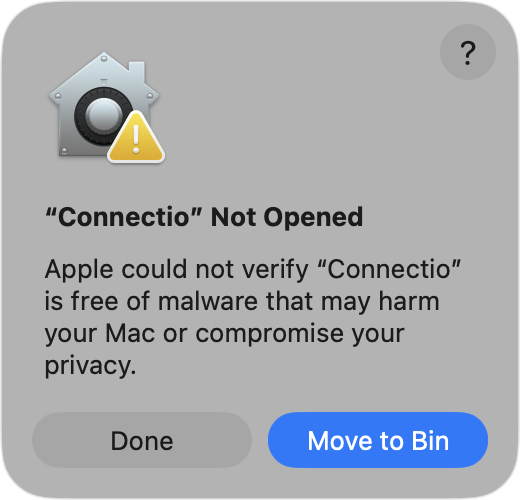
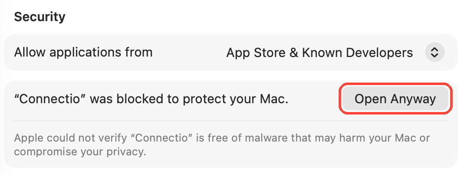

# Installing Connectio

- [Download](#download)
- [First launch](#first-launch)
  - [macOS](#macos)
  - [Windows](#windows)
  - [Linux](#linux)
- [Install from the terminal](#install-from-the-terminal)
- [Updating](#updating)
- [Uninstalling](#uninstalling)

## Download

Grab the latest build for your OS from the [**Releases page**](https://github.com/PulkitBanta/connectio/releases/latest):

| Platform              | File                                     |
| --------------------- | ---------------------------------------- |
| macOS (Apple Silicon) | `Connectio-<version>-arm64.dmg`          |
| Windows               | `Connectio.Setup.<version>.exe`          |
| Linux                 | `Connectio-<version>.AppImage` or `.deb` |

Intel Macs and other architectures aren't packaged yet — [build from source](README.md#build-from-source) instead.

## First launch

Connectio isn't code-signed yet, so macOS and Windows ask you to confirm the first time you open it. You only need to do this once per install. To skip it entirely, [install from the terminal](#install-from-the-terminal) instead.

### macOS

1. Open the `.dmg`, drag **Connectio** into **Applications**, and open it. macOS shows _"Connectio" Not Opened_ — click **Done** (not _Move to Bin_).

   

2. Open **System Settings → Privacy & Security**, scroll down to **Security**, and click **Open Anyway** next to _"Connectio" was blocked to protect your Mac_.

   

3. Click **Open Anyway** again in the confirmation dialog and enter your password or use Touch ID. Connectio opens normally from now on.

> [!TIP]
> If macOS instead says _"Connectio is damaged and can't be opened"_, run `xattr -cr /Applications/Connectio.app` in Terminal and open it again.

### Windows

When you run the installer, SmartScreen may show _"Windows protected your PC"_. Click **More info**, then **Run anyway**. Connectio installs for your user account and appears in the Start menu.

### Linux

- **`.deb`** (Debian, Ubuntu, and derivatives) — install with:

  ```bash
  sudo apt install ./connectio_<version>_amd64.deb
  ```

- **AppImage** (any distro) — mark it executable and run it:

  ```bash
  chmod +x Connectio-<version>.AppImage
  ./Connectio-<version>.AppImage
  ```

  Or right-click the file → _Properties_ → _Allow executing file as program_. AppImages need FUSE 2 (`libfuse2` on Ubuntu/Debian, `fuse` on Fedora/Arch).

## Install from the terminal

These scripts download the latest release for your OS and install it without the first-launch prompts.

**macOS / Linux**

```bash
curl -fsSL https://raw.githubusercontent.com/PulkitBanta/connectio/main/scripts/install.sh | sh
```

**Windows (PowerShell)**

```powershell
irm https://raw.githubusercontent.com/PulkitBanta/connectio/main/scripts/install.ps1 | iex
```

| OS      | What the script does                                                                                                    |
| ------- | ----------------------------------------------------------------------------------------------------------------------- |
| macOS   | Installs `Connectio.app` to `/Applications` (or `~/Applications` if that isn't writable). Apple Silicon only.           |
| Linux   | Installs the `.deb` via `apt` on Debian/Ubuntu; otherwise installs the AppImage to `~/.local/bin` with a desktop entry. |
| Windows | Downloads and runs the installer silently (per-user, no admin rights needed).                                           |

To install a specific version, set `CONNECTIO_VERSION`:

```bash
curl -fsSL https://raw.githubusercontent.com/PulkitBanta/connectio/main/scripts/install.sh | CONNECTIO_VERSION=1.1.0 sh
```

```powershell
$env:CONNECTIO_VERSION = "1.1.0"; irm https://raw.githubusercontent.com/PulkitBanta/connectio/main/scripts/install.ps1 | iex
```

Want to check what runs first? Read [`install.sh`](scripts/install.sh) and [`install.ps1`](scripts/install.ps1).

## Updating

Connectio doesn't update itself yet. To update, download the new release and install it over the old one, or re-run the install script. Your saved configs are kept.

## Uninstalling

| OS      | Remove the app                                                                                                                                                                        | Remove saved configs (optional)                      |
| ------- | ------------------------------------------------------------------------------------------------------------------------------------------------------------------------------------- | ---------------------------------------------------- |
| macOS   | Drag `Connectio.app` from Applications to the Bin                                                                                                                                     | `rm -rf ~/Library/Application\ Support/connectio`    |
| Windows | _Settings → Apps → Installed apps → Connectio → Uninstall_                                                                                                                            | Delete `%APPDATA%\connectio`                         |
| Linux   | `.deb`: `sudo apt remove connectio`<br />AppImage: `rm ~/.local/bin/connectio ~/.local/share/applications/connectio.desktop ~/.local/share/icons/hicolor/512x512/apps/connectio.png` | `rm -rf ~/.config/connectio`                         |
