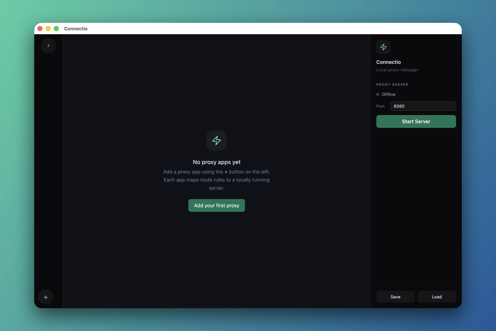
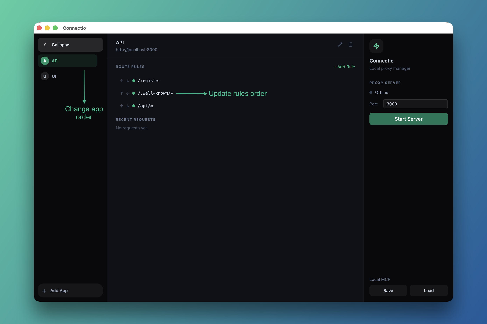
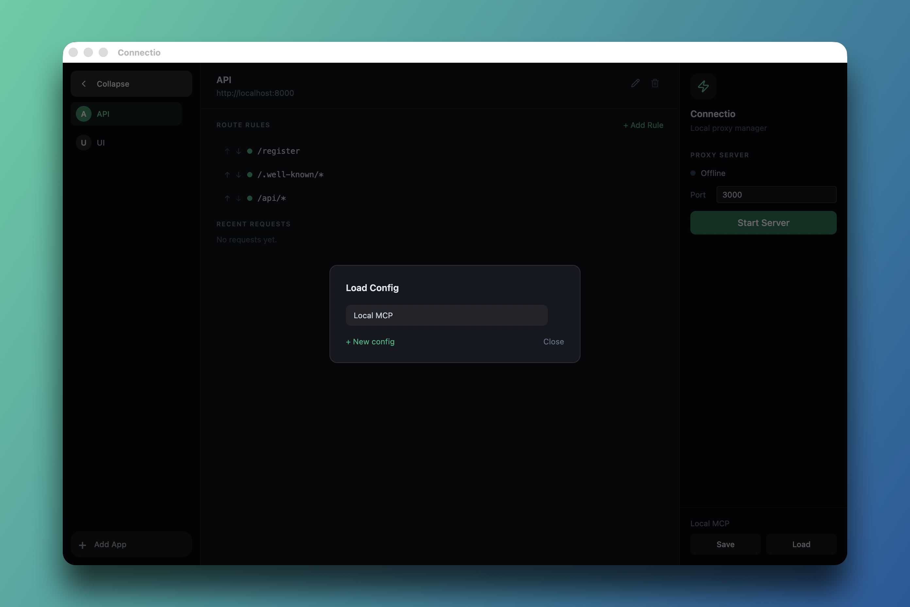

<p align="center">
  
</p>

<h1 align="center">Connectio</h1>

<p align="center">
  A local proxy manager — connect and route HTTP requests between your local servers from a single dashboard.
</p>

<p align="center">
  
  
  
</p>

---

## Screenshots

<p align="center">
  
</p>
<p align="center"><em>Home screen — clean starting point with server controls on the right sidebar</em></p>

<p align="center">
  
</p>
<p align="center"><em>Reorder apps and route rules to control matching priority</em></p>

<p align="center">
  
</p>
<p align="center"><em>Save and load named configurations to switch between project setups</em></p>

---

## Features

- **Proxy Apps** — Create multiple proxy apps, each pointing to a different local server (e.g. `localhost:3001`, `localhost:4000`).
- **Wildcard Route Rules** — Define path-based routing rules with glob-style wildcards (`/api/*`, `/auth/login`). Rules are matched in order, giving you full control over priority.
- **Real-Time Request Logs** — See every proxied request as it happens: method, path, status code, and response time, streamed live into the UI.
- **App Ordering** — Reorder proxy apps with up/down controls. Order determines rule priority — if the first app catches `/*`, it takes precedence.
- **Config Management** — Save and load named configurations as JSON files. Quickly switch between different project setups without reconfiguring from scratch.
- **Collapsible Sidebar** — Expand the left nav for full app names or collapse it to icon-only mode for more screen space.
- **Cross-Platform** — Runs on macOS, Windows, and Linux. Configs are stored in the OS-native user data directory.

## How It Works

Connectio runs an Express proxy server on a port you choose (default `8080`). When a request comes in, it walks your route rules in order, finds the first match, and proxies the request to the target server using `http-proxy-middleware`. Each response is logged back to the UI in real time.

```
Browser / cURL                         Your local servers
       │                                      ▲
       │  GET /api/users                      │
       ▼                                      │
  ┌──────────┐    match: /api/*    ┌──────────────────┐
  │ Connectio │ ─────────────────► │ localhost:3001    │
  │ :8080     │                    │ (API server)      │
  │           │    match: /*       ├──────────────────┤
  │           │ ─────────────────► │ localhost:3000    │
  └──────────┘                    │ (Frontend)        │
                                   └──────────────────┘
```

## Getting Started

### Prerequisites

- [Node.js](https://nodejs.org/) v22 or later
- [Yarn](https://classic.yarnpkg.com/) v1

### Install & Run

```bash
git clone https://github.com/PulkitBanta/connectio.git
cd connectio
yarn install
yarn start
```

### Quick Start

1. Click **+ Add App** in the left sidebar.
2. Give it a name (e.g. "API Server") and a target URL (e.g. `http://localhost:3001`).
3. Click the app, then **+ Add Rule** to define a route pattern like `/api/*`.
4. Set your port in the right sidebar and hit **Start Server**.
5. Send requests to `http://localhost:8080` and watch them get routed and logged in real time.

## Build & Release

### Local Build

```bash
yarn build
```

Produces platform-specific distributables in the `dist/` directory:

| Platform | Outputs        |
| -------- | -------------- |
| macOS    | `.dmg`, `.zip` |
| Windows  | `.nsis`, `.zip`|
| Linux    | `.AppImage`, `.deb` |

### CI / CD

Every push to `main` triggers a [GitHub Actions workflow](.github/workflows/release.yml) that builds for all three platforms and publishes a GitHub Release automatically.

The workflow uses:
- Node.js 24
- `electron-builder` with `--publish always`
- `GITHUB_TOKEN` for release uploads

## Development

```bash
yarn dev       # Start with DevTools open
yarn start     # Start without DevTools
yarn lint       # Run ESLint
yarn format     # Run Prettier
```

## Config Storage

Configs are saved as JSON files in the OS user data directory:

| OS      | Path                                              |
| ------- | ------------------------------------------------- |
| macOS   | `~/Library/Application Support/connectio/configs/` |
| Windows | `%APPDATA%/connectio/configs/`                     |
| Linux   | `~/.config/connectio/configs/`                     |

## Tech Stack

- **[Electron](https://www.electronjs.org/)** — Desktop shell
- **[Express 5](https://expressjs.com/)** — Proxy server
- **[http-proxy-middleware](https://github.com/chimurai/http-proxy-middleware)** — Request proxying
- **[Tailwind CSS](https://tailwindcss.com/)** — UI styling
- **[Lucide Icons](https://lucide.dev/)** — Icon set
- **[electron-builder](https://www.electron.build/)** — Packaging and distribution

## License

MIT
