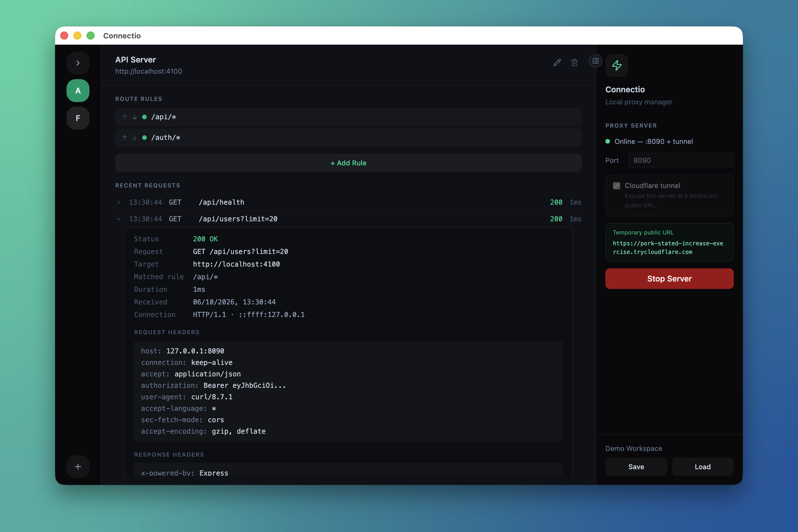
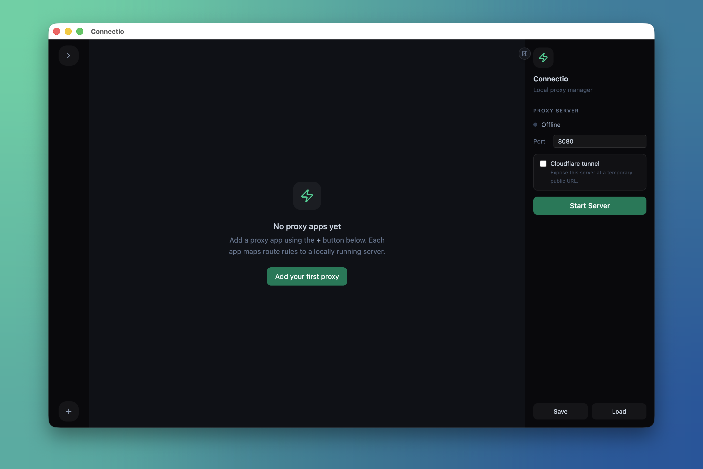
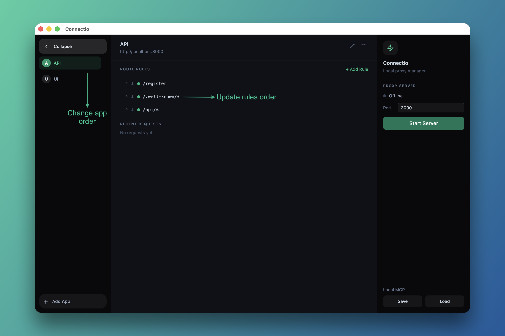
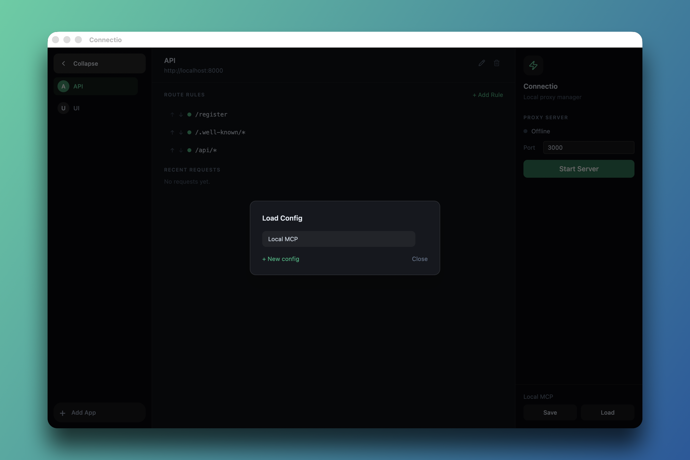
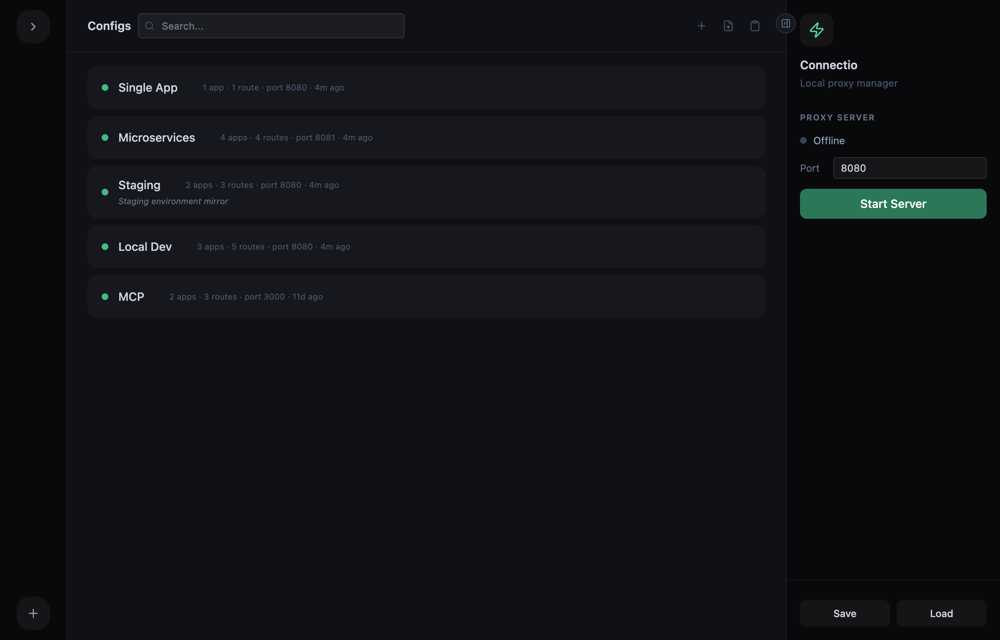
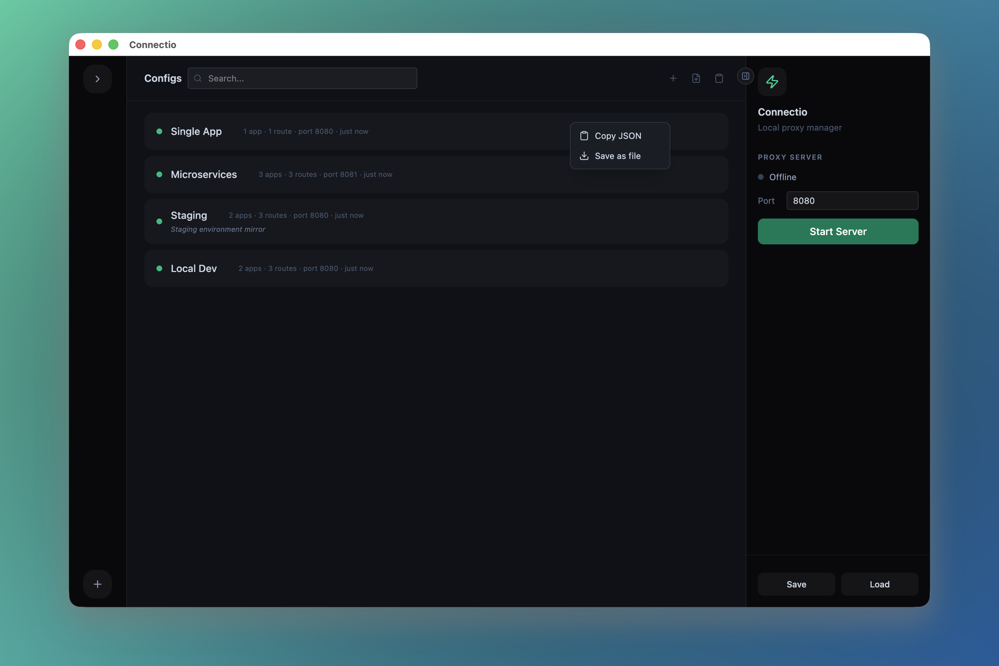
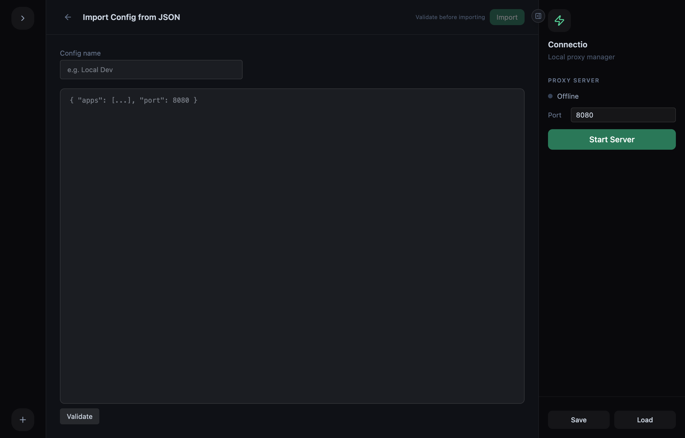

<p align="center">
  
</p>

<h1 align="center">Connectio</h1>

<p align="center">
  A local proxy manager — connect and route HTTP requests between your local servers from a single dashboard.
</p>

<p align="center">
  <a href="https://github.com/PulkitBanta/connectio/releases/latest"></a>
  <a href="https://github.com/PulkitBanta/connectio/actions/workflows/build.yml"></a>
  <a href="https://github.com/PulkitBanta/connectio/releases"></a>
  
  <a href="LICENSE"></a>
</p>

<p align="center">
  <a href="#see-it-in-action">Watch the tour</a> ·
  <a href="#download">Download</a> ·
  <a href="#features">Features</a> ·
  <a href="#quick-start">Quick Start</a> ·
  <a href="#contributing">Contributing</a>
</p>

<p align="center">
  
</p>

## Why Connectio?

Modern local development rarely runs on a single server. Your frontend is on `:3000`, the API on `:3001`, an auth service on `:4000` — and suddenly you're fighting CORS, cookies that won't cross ports, and webhooks that need one public URL.

Connectio puts all of them behind **one local address**. Define path rules like `/api/*` → `localhost:3001` and `/*` → `localhost:3000`, hit **Start**, and every request is routed, logged, and inspectable — no nginx config to write, no reverse-proxy to restart. When you need to share it, flip on a temporary Cloudflare tunnel.

## See it in action

A 60-second tour of the happy path — add apps, route rules, start the server, inspect requests, share through a tunnel, and save configs as JSON.

<p align="center">
  <a href="screenshots/connectio-launch.mp4"></a>
</p>

## Download

Grab the latest build for your OS from the [**Releases page**](https://github.com/PulkitBanta/connectio/releases/latest) — `.dmg` for macOS (Apple Silicon), `.exe` for Windows, `.AppImage` or `.deb` for Linux.

Or install from the terminal:

```bash
# macOS / Linux
curl -fsSL https://raw.githubusercontent.com/PulkitBanta/connectio/main/scripts/install.sh | sh
```

```powershell
# Windows (PowerShell)
irm https://raw.githubusercontent.com/PulkitBanta/connectio/main/scripts/install.ps1 | iex
```

> [!NOTE]
> Connectio isn't code-signed yet, so macOS and Windows ask you to confirm the first time you open a downloaded build. See the [**installation guide**](INSTALL.md#first-launch) for step-by-step instructions, plus updating and uninstalling.

## Features

- **Proxy Apps** — Create multiple proxy apps, each pointing to a different local server (e.g. `localhost:3001`, `localhost:4000`).
- **Wildcard Route Rules** — Define path-based routing rules with glob-style wildcards (`/api/*`, `/auth/login`). Rules are matched in order, giving you full control over priority.
- **Detailed Request Logs** — See every proxied request as it happens, then click a log to inspect its matched rule, target, connection metadata, and request/response headers.
- **Temporary Cloudflare Tunnels** — Opt in per config to expose the proxy at a temporary public `trycloudflare.com` URL while the server is running.
- **App Ordering** — Reorder proxy apps with up/down controls. Order determines rule priority — if the first app catches `/*`, it takes precedence.
- **Config Manager** — Browse, search, rename, and delete saved configurations from a dedicated configs list view.
- **JSON Import / Export** — Import configs by pasting raw JSON or selecting a file via the native dialog. Export any config as clipboard text or save as a `.json` file.
- **JSON Editor** — Edit any config's raw JSON directly in-app with validation and save.
- **Save & Load** — Quickly save the current state to a named config or load a previously saved one from the sidebar panel.
- **Collapsible Sidebar** — Expand the left nav for full app names or collapse it to icon-only mode for more screen space.
- **Cross-Platform** — Runs on macOS, Windows, and Linux. Configs are stored in the OS-native user data directory.

<details>
<summary><strong>More screenshots</strong></summary>
<br />

<table>
  <tr>
    <td width="50%"></td>
    <td width="50%"></td>
  </tr>
  <tr>
    <td align="center"><em>Home screen with server controls in the right sidebar</em></td>
    <td align="center"><em>Reorder apps and route rules to control matching priority</em></td>
  </tr>
  <tr>
    <td></td>
    <td></td>
  </tr>
  <tr>
    <td align="center"><em>Save and load named configurations</em></td>
    <td align="center"><em>Browse, search, and manage saved configs</em></td>
  </tr>
  <tr>
    <td></td>
    <td></td>
  </tr>
  <tr>
    <td align="center"><em>Export a config to the clipboard or a <code>.json</code> file</em></td>
    <td align="center"><em>Import a config by pasting raw JSON</em></td>
  </tr>
</table>

</details>

## How It Works

Connectio runs an Express proxy server on a port you choose (default `8080`). When a request comes in, it walks your route rules in order, finds the first match, and proxies the request to the target server using `http-proxy-middleware`. Each response is logged back to the UI in real time.

```
Browser / cURL                      Your local servers
       │                                   ▲
       │  GET /api/users                   │
       ▼                                   │
  ┌──────────┐   match: /api/*   ┌─────────────────┐
  │ Connectio│ ───────────────►  │ localhost:3001  │
  │ :8080    │                   │ (API server)    │
  │          │   match: /*       ├─────────────────┤
  │          │ ───────────────►  │ localhost:3000  │
  └──────────┘                   │ (Frontend)      │
                                 └─────────────────┘
```

## Quick Start

1. Click **+** in the left sidebar to add a proxy app.
2. Give it a name (e.g. "API Server") and a target URL (e.g. `http://localhost:3001`).
3. Click the app, then **+ Add Rule** to define a route pattern like `/api/*`.
4. Set your port in the right sidebar and hit **Start Server**.
5. Send requests to `http://localhost:8080` and watch them get routed and logged in real time.
6. Click any request in **Recent Requests** to inspect its matched rule, target, and headers.

### Sharing with a Cloudflare tunnel

Enable **Cloudflare tunnel** before starting the server. Connectio runs a [Cloudflare Quick Tunnel](https://developers.cloudflare.com/cloudflare-one/networks/connectors/cloudflare-tunnel/do-more-with-tunnels/trycloudflare/), shows the generated public URL (click to copy), and closes it when you stop the server. This requires [`cloudflared`](https://developers.cloudflare.com/cloudflare-one/networks/connectors/cloudflare-tunnel/downloads/) on your `PATH` (or set `CLOUDFLARED_PATH`).

> [!WARNING]
> A tunnel makes **every route** in your proxy reachable by anyone on the internet who has the URL — there is no authentication in front of it. Only enable it for servers you're comfortable exposing, and stop the server when you're done. Quick Tunnels are intended for development and testing, not production.

## Config Storage

Configs are saved as JSON files in the OS user data directory:

| OS      | Path                                               |
| ------- | -------------------------------------------------- |
| macOS   | `~/Library/Application Support/connectio/configs/` |
| Windows | `%APPDATA%/connectio/configs/`                     |
| Linux   | `~/.config/connectio/configs/`                     |

A config looks like this (`cloudflareTunnel` is optional and defaults to off):

```json
{
  "apps": [
    {
      "id": "api",
      "name": "API Server",
      "targetUrl": "http://localhost:3001",
      "enabled": true,
      "rules": [{ "id": "r1", "matchPath": "/api/*", "enabled": true }]
    }
  ],
  "port": 8080,
  "cloudflareTunnel": false
}
```

## Contributing

Contributions are welcome! Bug reports and feature ideas go in [Issues](https://github.com/PulkitBanta/connectio/issues); for code changes, open a pull request against `main`.

### Build from source

Requires [Node.js](https://nodejs.org/) v22+ and [Yarn](https://classic.yarnpkg.com/) v1.

```bash
git clone https://github.com/PulkitBanta/connectio.git
cd connectio
yarn install
yarn dev        # Start with DevTools open
```

| Command       | What it does                                  |
| ------------- | --------------------------------------------- |
| `yarn dev`    | Start the app with hot reload and DevTools    |
| `yarn start`  | Preview the production build without DevTools |
| `yarn lint`   | Run ESLint                                    |
| `yarn format` | Run Prettier                                  |
| `yarn build`  | Build and package distributables into `dist/` |

### Guidelines

- Run `yarn lint` and `yarn format` before pushing.
- Use [Conventional Commits](https://www.conventionalcommits.org/) (`feat:`, `fix:`, `docs:`, `chore:`, …) — release notes and version bumps are generated from them.
- Keep PRs focused; include a screenshot for UI changes.

### Build & Release

- **Build** — Every push to `main` and every PR runs the [build workflow](.github/workflows/build.yml) on macOS, Windows, and Linux.
- **Release** — [release-please](https://github.com/googleapis/release-please) watches `main` and keeps a release PR open with the next version and [changelog](CHANGELOG.md). Merging that PR tags the release, and the [release workflow](.github/workflows/release.yml) builds all three platforms and attaches the installers to the GitHub Release.

<details>
<summary><strong>Tech stack</strong></summary>

- **Desktop Shell** — [Electron](https://www.electronjs.org/) with context isolation
- **UI Framework** — [Solid.js](https://www.solidjs.com/) with TypeScript — signals-based reactivity for fast, predictable renders
- **Styling** — [Tailwind CSS v4](https://tailwindcss.com/) via `@tailwindcss/vite` plugin
- **Icons** — [Lucide](https://lucide.dev/) rendered as native Solid SVG components
- **Build Tool** — [electron-vite](https://github.com/alex8088/electron-vite/) — fast HMR for main, preload, and renderer
- **Packaging** — [electron-builder](https://www.electron.build/) — produces `.dmg`, `.AppImage`, `.deb`, `.exe`
- **Proxy Server** — [Express 5](https://expressjs.com/) — incoming request handling
- **Proxying** — [http-proxy-middleware](https://github.com/chimurai/http-proxy-middleware) — route matching and reverse proxying
- **Linting** — ESLint v10 with `typescript-eslint`
- **Formatting** — Prettier

</details>

<details>
<summary><strong>Project structure</strong></summary>

```
src/
├── main/               # Electron main process
│   ├── index.ts        # App lifecycle, window creation
│   ├── server.ts       # Proxy IPC handlers, request log + tunnel status forwarding
│   ├── configs.ts      # Config CRUD — list, load, save, delete, rename, export, import
│   └── ipc.ts          # Registers all IPC handlers
├── preload/
│   └── index.ts        # Context bridge — exposes window.connectio to the renderer
├── renderer/           # Solid.js UI
│   ├── index.html      # Shell HTML
│   ├── index.tsx       # Solid entry point
│   ├── App.tsx         # Root component — view router, layout
│   ├── components/     # UI components (Nav, ProxyView, ConfigsView, etc.)
│   ├── lib/            # State (signals), IPC client, utilities, constants
│   └── styles/
│       └── index.css   # Tailwind entry
└── server.js           # Express proxy server, rule matching, Cloudflare tunnel process
```

</details>

## License

[MIT](LICENSE) © Pulkit Banta
